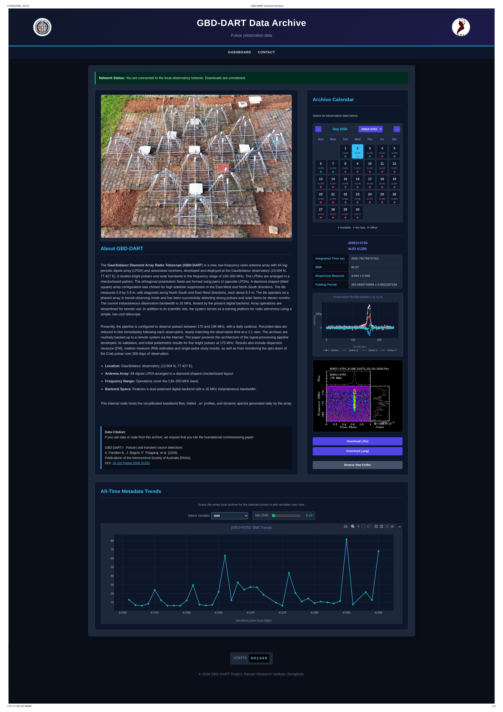

# GBD_Archive_server
 A server to host and distribute the GBD-DART pulsar data.

## Overview
This repository hosts the interactive, astrophysics-themed web archive for the Gauribidanur Diamond Array Radio Telescope (GBD-DART) pulsar project. It operates as a local access node for high-speed data retrieval, displaying observation data, metadata, and long-term trends. 

## Key Features
* **Calendar Browser**: An interactive, calendar-based file browser to navigate daily observations.
* **Stokes Polarization Plots**: Automatically parses metadata arrays to plot 1D Stokes profiles (I, Q, U, V) using a responsive Plotly.js interface.
* **Dynamic File Sizes & Smart Downloads**: Frontend intelligently fetches file sizes via asynchronous `HEAD` requests, restricting direct download buttons to `profile.fits` and `profile.png` files.
* **Server-Side Zipping**: Bypasses browser memory limits by using a custom Python backend to compress and stream entire gigabyte-sized observation folders directly to the user's disk over the local network.
* **Custom Raw Directory**: A built-in, dark-themed raw file browser that accurately displays human-readable file sizes and allows easy navigation back to the dashboard.
* **All-Time Trends & Advanced Filtering**: A built-in crawler aggregates daily JSON metadata across the archive to plot variables over time. Features real-time sliders to filter data based on **Min SNR**, **Max SNR**, and **Standard Deviation (Z-score)** to easily remove statistical outliers.

## Directory & Data Structure
The archive dynamically crawls local directories. Data must be mounted in the predefined `PARENT_DIR` (default: `pulsar_data/`) following this exact flat-date format: 
`[PARENT_DIR]/[PULSAR_NAME]/DD_MM_YYYY/` (e.g., `pulsar_data/J0534+2200/07_09_2026/`).
[Directory Structure](doc/directory_structure.txt)

Each daily observation folder must include a `metadata.json` file containing:
* Base scalar values like `Integration_Time_sec` and `SNR`.
* Associated uncertainty values designated by an `_err` suffix (e.g., `Dispersion_Measure_err`).
* Array data for `Profile_bins`, `I`, `Q`, `U`, and `V` for the interactive plots.

## Setup Instructions

### Mount GBD-DART Archive Data disk
1. Check disk name and edit mount point inside the file `mount_disk.sh`.
2. Mount disk by running: `bash mount_disk.sh`
3. Make sure you are accessing/seeing the folder/files as shown in `Directory & Data Structure` section. 

### Prerequisites
This project relies purely on the Python Standard Library. **No external pip packages are required.**
* Python 3.6 or higher.

### Running the Server
1. Clone this repository to your local observatory node.
2. Ensure your uncalibrated baseband files, dynamic spectra, and `metadata.json` files are organized into the required `DD_MM_YYYY` directory structure.
3. Start the custom multi-threaded Python server in the project root by running:`bash start_server.sh`.
4. Default Port number is `8000`. You can change in `start_server.sh`.
5. Navigate your browser to `http://localhost:8000` to access the dark-themed UI.

**Data Citation:**
If you use data or code from this archive, we request that you cite the foundational commissioning paper:

*GBD-DART-I: Pulsars and transient source observation between 130 and 350 MHz at Gauribidanur*
A. Pandian B., J. Bagchi, P. Thiagaraj, et al. (2026).
Publications of the Astronomical Society of Australia (PASA).
DOI: [10.1017/pasa.2026.10231](https://doi.org/10.1017/pasa.2026.10231)
